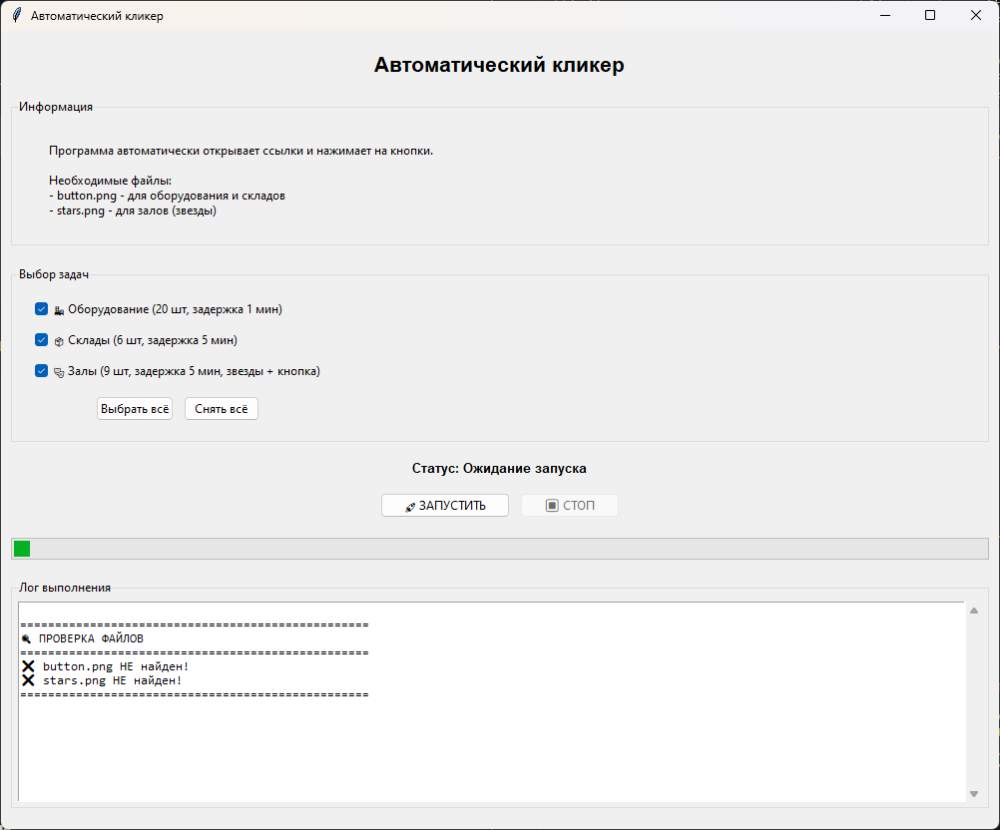

# 🖱️ CinemaQR - Умный планировщик автоматизации

Автоматический кликер с умным планировщиком задач для работы с веб-интерфейсами. Позволяет выполнять несколько цепочек действий параллельно, перекрывая время ожидания между запросами.

## 📋 Содержание

- [Особенности](#-особенности)
- [Скриншоты и демонстрация](#-скриншоты-и-демонстрация)
- [Установка](#-установка)
- [Использование](#-использование)
- [Архитектура](#-архитектура)
- [Сборка EXE](#-сборка-exe)
- [Технологии](#-технологии)
- [Вклад в проект](#-вклад-в-проект)
- [Лицензия](#-лицензия)

## 📸 Скриншоты и демонстрация

### 🎥 Видео демонстрация работы

Посмотрите, как работает программа в действии:

[](media/video.mp4)

*Нажмите на изображение, чтобы открыть видео*

### 🎬 Анимированная демонстрация (GIF)

Вот как выглядит работа программы в реальном времени:


*GIF демонстрирует процесс автоматического кликинга в реальном времени*

### 📊 Что вы видите на GIF:

1. **Запуск программы** — открытие главного окна с выбором задач
2. **Выбор задач** — активация нужных типов (оборудование, склады, залы)
3. **Автоматическая работа** — открытие браузера, переход по ссылкам, нажатие кнопок
4. **Логирование** — отображение всех действий в реальном времени
5. **Завершение** — успешное выполнение всех задач

## ✨ Особенности

- 🧠 **Умный планировщик** - выполняет задачи с перекрытием времени ожидания
- 🔄 **Параллельное выполнение** - несколько типов задач одновременно
- 🖥️ **Графический интерфейс** - удобный выбор задач и контроль в реальном времени
- 📊 **Подробное логирование** - цветной лог с временными метками
- 🔍 **Поиск по изображению** - использует компьютерное зрение для поиска элементов
- 📸 **Отладка** - автоматическое создание скриншотов при ошибках
- 🚀 **Автономный EXE** - работает без установки Python
- 🛑 **Безопасная остановка** - корректное завершение всех потоков

## 🚀 Установка

### Вариант 1: Использование готового EXE

1. Скачайте последний релиз из [Releases](https://github.com/ShurikPozd/CinemaQR/releases)
2. Распакуйте архив
3. Запустите `CinemaQR.exe`

### Вариант 2: Запуск из исходного кода

1. Клонируйте репозиторий:
```bash
git clone https://github.com/ShurikPozd/CinemaQR.git
cd CinemaQR
```

2. Установите зависимости:
```bash
pip install -r requirements.txt
```

3. Запустите программу:
```bash
python src/clicker.py
```

## 🎮 Использование

1. **Подготовьте изображения кнопок:**
   - `button.png` - изображение кнопки для нажатия
   - `stars.png` - изображение звезд (для залов)

2. **Запустите программу**

3. **Выберите типы задач:**
   - ✅ Оборудование (20 шт, задержка 1 мин)
   - ✅ Склады (6 шт, задержка 5 мин)
   - ✅ Залы (9 шт, задержка 5 мин, звезды + кнопка)

4. **Нажмите "ЗАПУСТИТЬ"**

5. **Программа автоматически:**
   - Откроет браузер
   - Перейдет по ссылкам
   - Нажмет кнопки
   - Закроет вкладки
   - Будет выполнять задачи параллельно

6. **Для остановки** - нажмите "СТОП"

## 🏗️ Архитектура

```
┌─────────────────────────────────────────────────────┐
│                   GUI (tkinter)                     │
│  ┌──────────────────────────────────────────────┐   │
│  │   Выбор задач   │   Статус   │   Лог         │   │
│  └──────────────────────────────────────────────┘   │
└─────────────────────────────────────────────────────┘
                        │
                        ▼
┌─────────────────────────────────────────────────────┐
│              TaskScheduler (Планировщик)            │
│  ┌──────────────┐  ┌──────────────┐  ┌───────────┐  │
│  │ Оборудование │  │    Склады    │  │   Залы    │  │
│  │   (20 шт)    │  │    (6 шт)    │  │  (9 шт)   │  │
│  │ задержка 1м  │  │  задержка 5м │  │задержка 5м│  │
│  └──────────────┘  └──────────────┘  └───────────┘  │
└─────────────────────────────────────────────────────┘
                        │
                        ▼
┌─────────────────────────────────────────────────────┐
│             Браузер (Chrome/Yandex/Edge)            │
│    Открытие вкладок → Клики → Закрытие вкладок      │
└─────────────────────────────────────────────────────┘
```

### Как это работает

1. **Планировщик** запускает все выбранные задачи одновременно
2. Каждая задача имеет свою задержку (1 мин или 5 мин)
3. Пока одна задача ждет, выполняются другие
4. **Общее время** = время самой длительной задачи (~45 минут)

## 🔧 Сборка EXE

Для создания автономного EXE файла выполните:

### Windows

```bash
# Установите PyInstaller
pip install pyinstaller

# Соберите EXE
pyinstaller --onefile --windowed --icon=assets/icon.ico --name=CinemaQR src/clicker.py
```

### Или используйте скрипт:

```bash
cd build
build_all.bat
```

Готовый EXE будет в папке `dist/`

## 🛠️ Технологии

- **Python 3.8+** - основной язык
- **tkinter** - графический интерфейс
- **pyautogui** - автоматизация мыши и клавиатуры
- **opencv-python** - поиск изображений на экране
- **threading** - многопоточность
- **pyinstaller** - сборка EXE
- **pygetwindow** - управление окнами
- **pillow** - работа с изображениями

## 🤝 Вклад в проект

Мы приветствуем вклад в проект! Пожалуйста, прочитайте [CONTRIBUTING.md](CONTRIBUTING.md) перед отправкой pull request.

### Как помочь

1. Форкните репозиторий
2. Создайте ветку для фичи (`git checkout -b feature/AmazingFeature`)
3. Закоммитьте изменения (`git commit -m 'Add some AmazingFeature'`)
4. Запушьте в ветку (`git push origin feature/AmazingFeature`)
5. Откройте Pull Request

## 📝 Лицензия

Проект распространяется под лицензией MIT. Подробнее в файле [LICENSE](LICENSE).

## 📧 Контакты

- Автор: Поздняков Александр Дмитриевич
- Email: shurik-3002@mail.ru
- Telegram: https://t.me/shurikpozd

## ⭐ Поддержка

Если проект оказался полезным, поставьте звезду ⭐ на GitHub!

---

**Сделано с ❤️ для автоматизации рутины**
